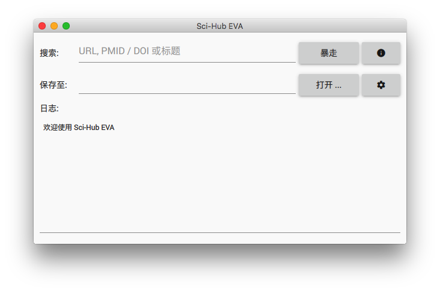
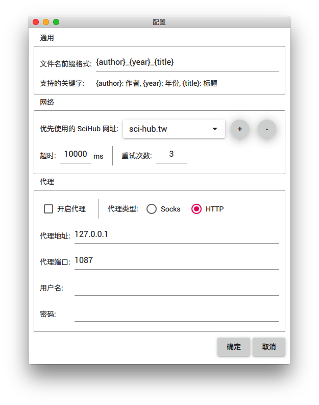

# Sci-Hub EVA 

---

## Introduction

**Sci-Hub EVA** is a cross-platform [Sci-Hub](https://en.wikipedia.org/wiki/Sci-Hub) GUI application.

## Usage

Launch the app, click `OPEN ...` to choose where to save the download files. Fill the query and click `RAMPAGE`, then it will search and download.

Currently, you can fill the query with `URL`, `DOI` / `PMID` or search string.

You may want to change some settings through the `Preferences` menu.

## Building

See [`BUILDING.md`](BUILDING.md)

---

## 简介

**Sci-Hub EVA** 是一个跨平台的 [Sci-Hub](https://zh.wikipedia.org/wiki/Sci-Hub) 界面化应用。

## 使用

启动程序后，按 `打开 ...` 选择文件的保存路径。填入搜索内容后，按 `暴走` 开始搜索并下载。

目前，支持的搜索类型有 `URL`，`DOI` / `PMID` 和标题搜索。

通过 `Preferences` 菜单可以修改程序的相关配置。

## 构建

见 [`BUILDING.md`](BUILDING.md)

---

## If You Like This, Buy Me a Coffee | 如果喜欢，请我喝杯咖啡吧

<table border="0">
  <tr>
    <td align="center"></td>
    <td align="center"></td>
    <td align="center"></td>
  </tr>
    <td align="center">支付宝</td>
    <td align="center">微信</td>
    <td align="center">Paypal</td>
  <tr>
  </tr>
</table>
