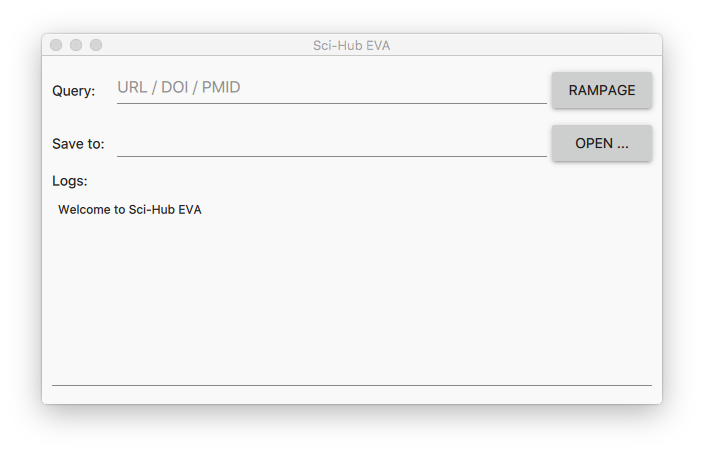
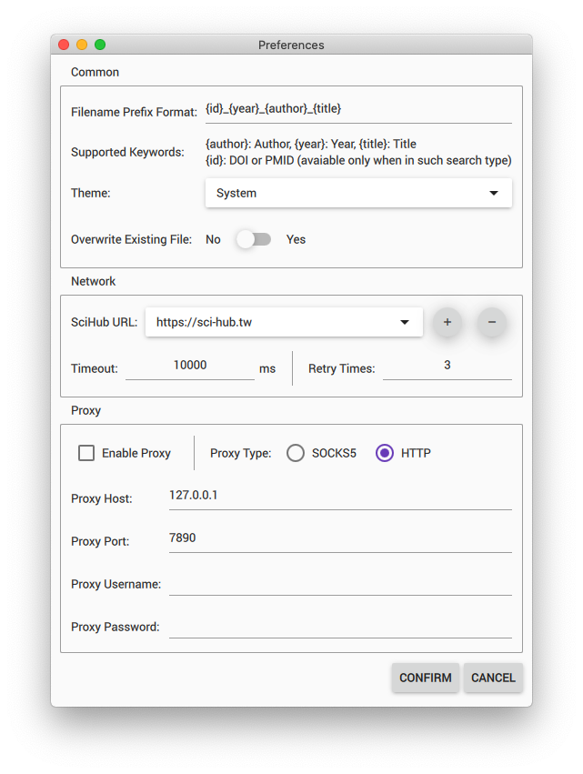
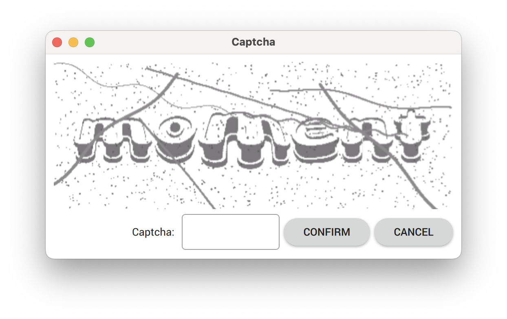
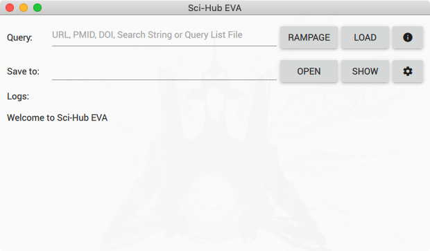
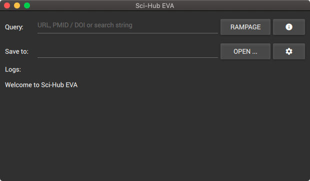
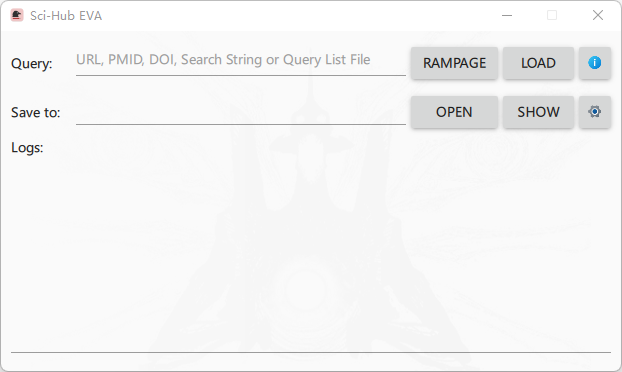
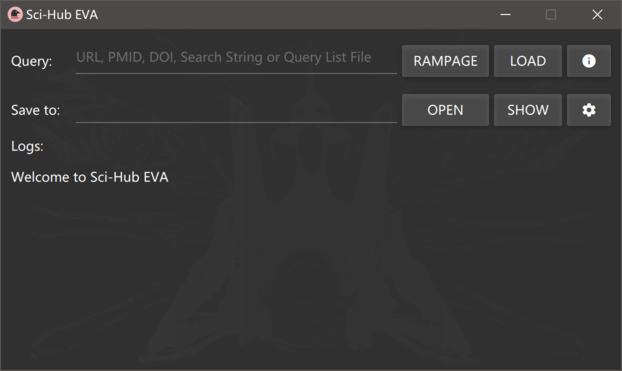

# Sci-Hub EVA 

---

## Introduction

**Sci-Hub EVA** is a cross-platform [Sci-Hub](https://en.wikipedia.org/wiki/Sci-Hub) GUI application written in Python and Qt (PySide2).

## Usage

Launch the app, click `OPEN ...` to choose where to save the download files. Fill the query and click `RAMPAGE`, then it will search and download. Currently, you can fill the query with `URL`, `DOI` / `PMID` or search string.

You may want to change some options in the `Preferences`. Due to the unstable Sci-Hub host accessibility, it may fail to download PDFs sometimes, you can change or add other Sci-Hub URLs.

Sometimes, you need enter the captcha to continue the download.

## Internationalization Support

- English
- Simplified Chinese (简体中文)
- Traditional Chinese - Hongkong (繁體中文 - 香港)
- Traditional Chinese - Taiwan (正體中文 - 臺灣)

## Platform Support

### macOS

<table border="0">
  <tr align="center">
    <td></td>
    <td></td>
  </tr>
  <tr align="center">
    <td>Light Theme</td>
    <td>Dark Theme</td>
  </tr>
  </tr>
</table>

### Windows

<table border="0">
  <tr align="center">
    <td></td>
    <td></td>
  </tr>
  <tr align="center">
    <td>Light Theme</td>
    <td>Dark Theme</td>
  </tr>
</table>

## Building

See [`building/README.md`](building/README.md)

## Licenses

[SciHubEVA](https://github.com/leovan/SciHubEVA): The MIT License (MIT)

[PySide2](https://doc.qt.io/qtforpython): GNU Lesser General Public License (LGPL)

[Material design icons](https://github.com/templarian/MaterialDesign/): [SIL Open Font License 1.1](http://scripts.sil.org/cms/scripts/page.php?item_id=OFL_web)
