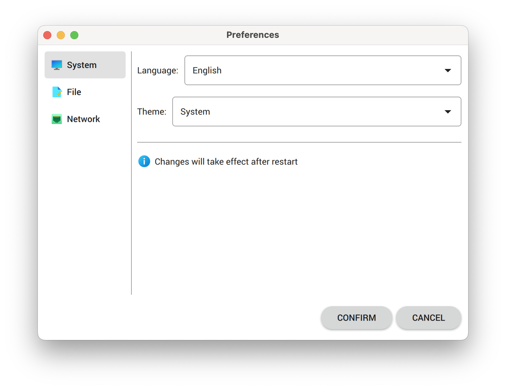
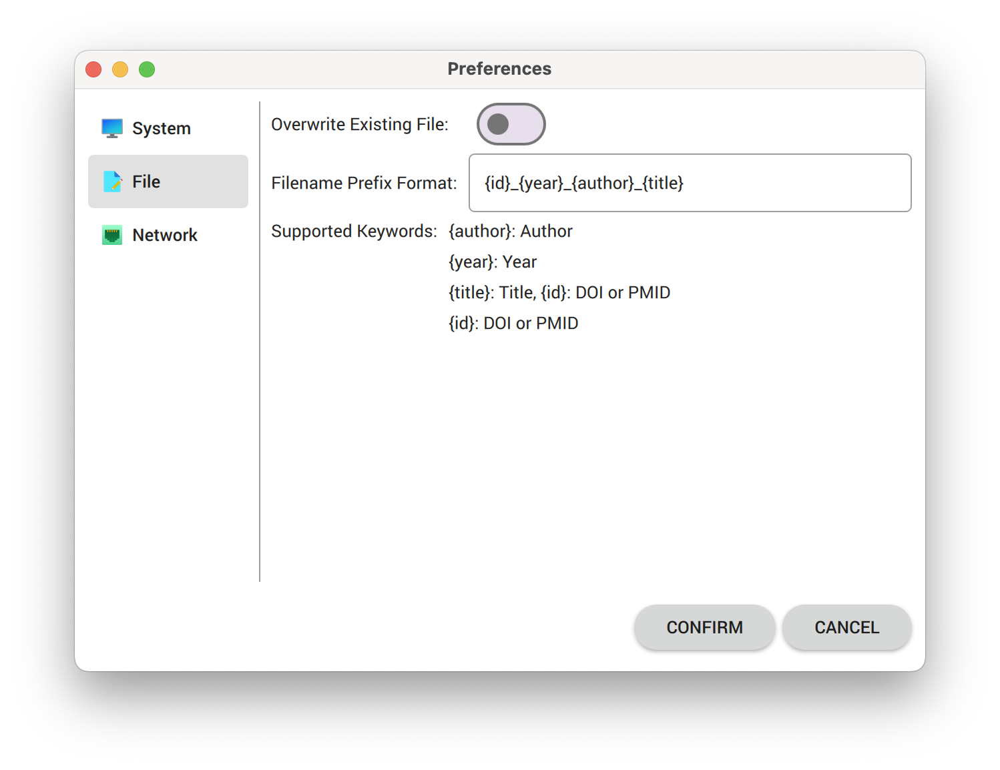
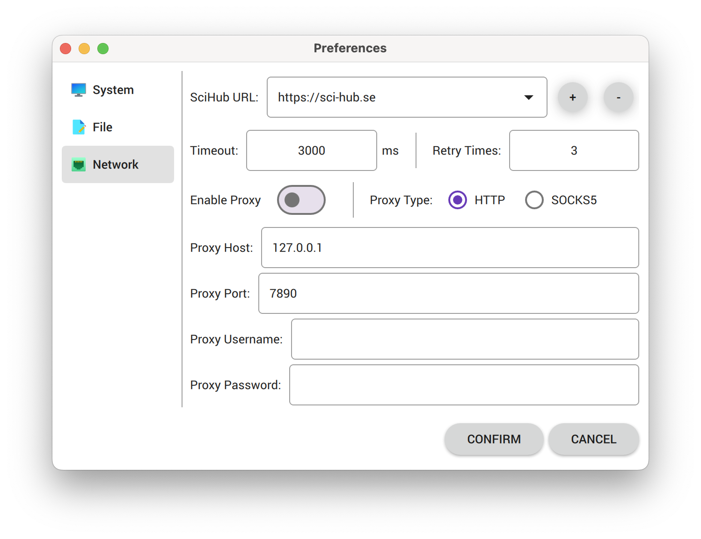

# Sci-Hub EVA 

---

## Introduction

**Sci-Hub EVA** is a cross-platform [Sci-Hub](https://en.wikipedia.org/wiki/Sci-Hub) GUI application written in Python and Qt.

## Usage

Click `OPEN` button to choose where to save the downloaded files. Click `SHOW` button will open the directory where you set.

Fill the query and click `RAMPAGE` button, then it will search the query and download the file. Currently, you can fill the query with `URL`, `DOI`, `PMID` or search string.

Range pattern in query is supported, e.g. `00.000/{1-99}` will download `00.000/1`, `00.000/2`, ... `00.000/99`. Zero padded format range pattern is allowed, e.g. `00.000/{01-99}` will download `00.000/01`, `00.000/02`, ... `00.000/99`.

Also you can download with a query list file, in which each line represents a query. Click `LOAD` button to load the query list file.

Right clicking the log area will popup menu, you can open the log file or log directory.

Click `GEAR` icon button, it will open `Preferences` dialog, and you can change options in it.

You can change language manually. Light and dark theme are supported, also you can choose `System` to fit system theme automatically. Changes will take effect after restart.

You can change filename prefix format with supported keywords. Setting overwrite existing file to `No` will add a timestamp suffix in filename to avoid overwriting previous downloaded files.

Due to the unstable Sci-Hub host accessibility, it may fail to download PDFs sometimes, you can change and add other Sci-Hub URLs, or set a proxy server.

Sometimes, you need enter the captcha to continue the download.

## Internationalization Support

- English
- Simplified Chinese (简体中文)
- Traditional Chinese - Hongkong (繁體中文 - 香港)
- Traditional Chinese - Taiwan (正體中文 - 臺灣)

## Platform Support

### macOS

<table border="0">
  <tr align="center">
    <td></td>
    <td></td>
  </tr>
  <tr align="center">
    <td>Light Theme</td>
    <td>Dark Theme</td>
  </tr>
  </tr>
</table>

### Windows

<table border="0">
  <tr align="center">
    <td></td>
    <td></td>
  </tr>
  <tr align="center">
    <td>Light Theme</td>
    <td>Dark Theme</td>
  </tr>
</table>

## Installing

### macOS

- Install with [DMG file](https://github.com/leovan/SciHubEVA/releases).
- Install from brew cask.  
  `brew install --cask scihubeva`

### Windows

- Install with [EXE setup file](https://github.com/leovan/SciHubEVA/releases).

## Building

See [`building/README.md`](building/README.md)

## Licenses

[SciHubEVA](https://github.com/leovan/SciHubEVA): The MIT License (MIT)

[PySide6](https://doc.qt.io/qtforpython): GNU Lesser General Public License (LGPL)

Icons: GNU General Public License 3.0 (GPL-3.0), modified from [Numix Circle](https://github.com/numixproject/numix-icon-theme-circle).

## Acknowledgement

Supported by JetBrains Free License Programs for Open Source Development.

  
  

