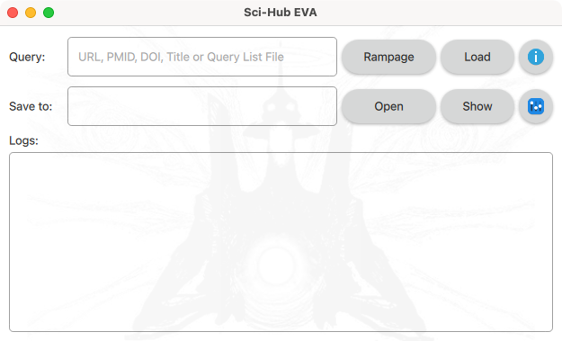
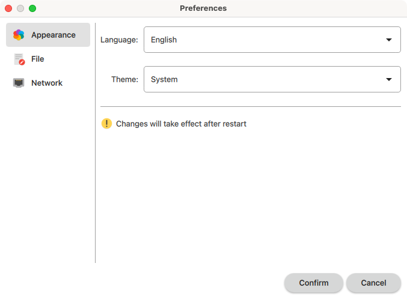
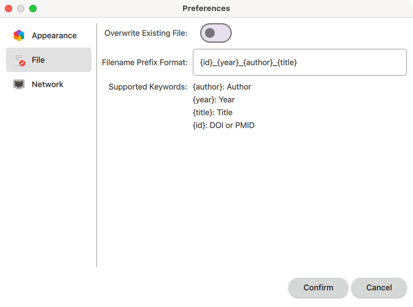
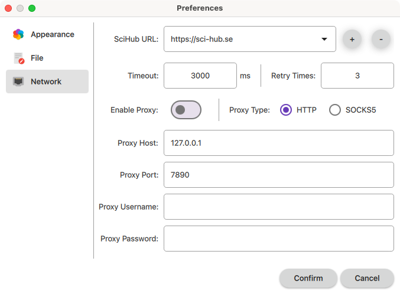
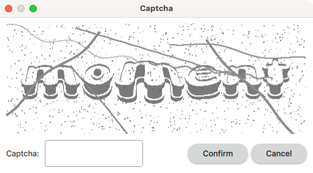
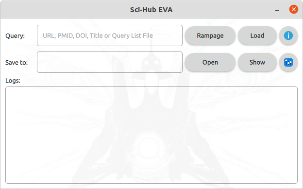
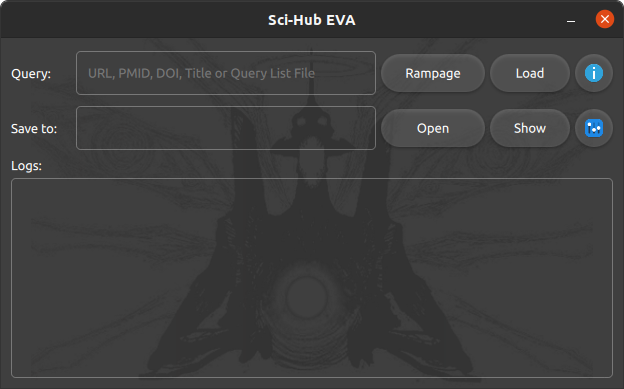

# Sci-Hub EVA 

---

## Introduction

**Sci-Hub EVA** is a cross-platform [Sci-Hub](https://en.wikipedia.org/wiki/Sci-Hub) GUI application powered by Python and Qt.

## Usage

Click `Open` button to choose where to save the downloaded files. Click `Show` button will open the directory where you set.

Fill the `Query` and click `Rampage` button, then it will search and download the file. Currently, you can fill the query with `URL`, `PMID`, `DOI` or title.

Range pattern in query is supported, e.g. `00.000/{1-99}` will download `00.000/1`, `00.000/2`, ... `00.000/99`. Zero padded format range pattern is allowed, e.g. `00.000/{01-99}` will download `00.000/01`, `00.000/02`, ... `00.000/99`.

Also you can download with a query list file, in which each line represents a query. Click `Load` button to load the query list file.

Right clicking the log area will popup menu, you can open the log file or log directory.

Click  will show the `About` dialog.

Click  will open the `Preferences` dialog.

You can change language manually. Light and dark theme are supported, also you can choose `System` to fit system theme automatically. Changes will take effect after restart.

You can change filename prefix format with supported keywords. Setting overwrite existing file to `No` will add a timestamp suffix in filename to avoid overwriting previous downloaded files.

Due to the unstable Sci-Hub host accessibility, it may fail to download PDFs sometimes, you can change and add other Sci-Hub URLs, or set a proxy server.

Sometimes, you may need enter the captcha to continue.

## Internationalization Support

- English
- Simplified Chinese (简体中文)
- Traditional Chinese - Hongkong (繁體中文 - 香港)
- Traditional Chinese - Taiwan (正體中文 - 臺灣)
- Portuguese - Portugal

## Platform Support

### macOS

<table border="0">
  <tr align="center">
    <td></td>
    <td></td>
  </tr>
  <tr align="center">
    <td>Light Theme</td>
    <td>Dark Theme</td>
  </tr>
  </tr>
</table>

### Windows

<table border="0">
  <tr align="center">
    <td></td>
    <td></td>
  </tr>
  <tr align="center">
    <td>Light Theme</td>
    <td>Dark Theme</td>
  </tr>
</table>

### Linux

<table border="0">
  <tr align="center">
    <td></td>
    <td></td>
  </tr>
  <tr align="center">
    <td>Light Theme</td>
    <td>Dark Theme</td>
  </tr>
</table>

## Installing

### macOS

- Install with [dmg file](https://github.com/leovan/SciHubEVA/releases).
- Install with brew: `brew install --cask scihubeva`.

### Windows

- Install with [setup file](https://github.com/leovan/SciHubEVA/releases).
- Install with scoop: `scoop bucket add scoopet https://github.com/ivaquero/scoopet && scoop install scihubeva`.

### Linux

- Run the [AppImage file](https://github.com/leovan/SciHubEVA/releases). Using [AppImageLauncher](https://github.com/TheAssassin/AppImageLauncher) is recommended.

> **Note**  
> Tested only on Ubuntu 20.04 and Ubuntu 22.04.

## Building

See [`building/README.md`](building/README.md)

## Licenses

The MIT License (MIT)
